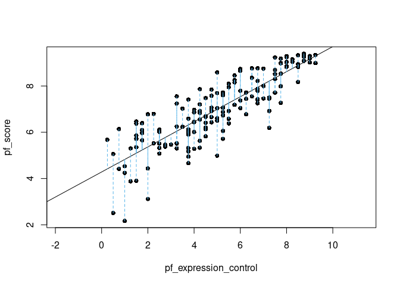
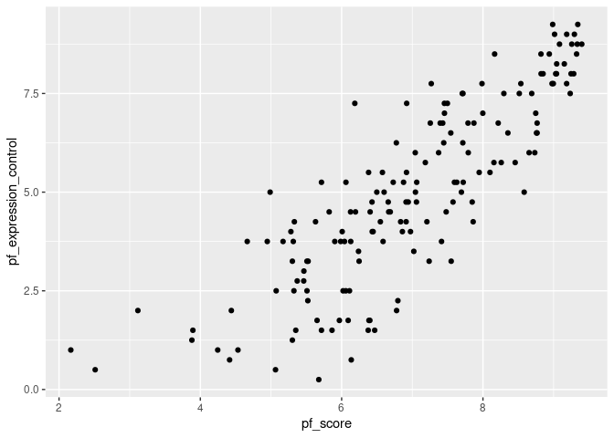
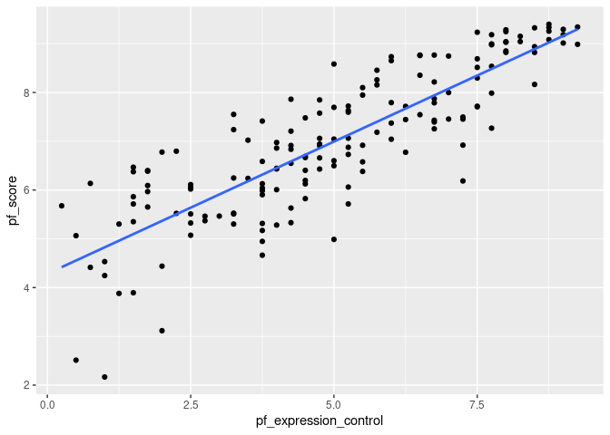

Activity 2 - Day 1
================

``` r
library(tidyverse)
```

    ## ── Attaching packages ─────────────────────────────────────── tidyverse 1.3.2 ──
    ## ✔ ggplot2 3.3.6     ✔ purrr   0.3.4
    ## ✔ tibble  3.2.1     ✔ dplyr   1.1.1
    ## ✔ tidyr   1.2.0     ✔ stringr 1.4.1
    ## ✔ readr   2.1.2     ✔ forcats 0.5.2
    ## ── Conflicts ────────────────────────────────────────── tidyverse_conflicts() ──
    ## ✖ dplyr::filter() masks stats::filter()
    ## ✖ dplyr::lag()    masks stats::lag()

``` r
library(tidymodels)
```

    ## ── Attaching packages ────────────────────────────────────── tidymodels 1.0.0 ──
    ## ✔ broom        1.0.0     ✔ rsample      1.1.0
    ## ✔ dials        1.0.0     ✔ tune         1.0.0
    ## ✔ infer        1.0.3     ✔ workflows    1.0.0
    ## ✔ modeldata    1.0.0     ✔ workflowsets 1.0.0
    ## ✔ parsnip      1.0.1     ✔ yardstick    1.0.0
    ## ✔ recipes      1.0.1     
    ## ── Conflicts ───────────────────────────────────────── tidymodels_conflicts() ──
    ## ✖ scales::discard() masks purrr::discard()
    ## ✖ dplyr::filter()   masks stats::filter()
    ## ✖ recipes::fixed()  masks stringr::fixed()
    ## ✖ dplyr::lag()      masks stats::lag()
    ## ✖ yardstick::spec() masks readr::spec()
    ## ✖ recipes::step()   masks stats::step()
    ## • Dig deeper into tidy modeling with R at https://www.tmwr.org

``` r
hfi = readr::read_csv("https://www.openintro.org/data/csv/hfi.csv")
```

    ## Rows: 1458 Columns: 123
    ## ── Column specification ────────────────────────────────────────────────────────
    ## Delimiter: ","
    ## chr   (3): ISO_code, countries, region
    ## dbl (120): year, pf_rol_procedural, pf_rol_civil, pf_rol_criminal, pf_rol, p...
    ## 
    ## ℹ Use `spec()` to retrieve the full column specification for this data.
    ## ℹ Specify the column types or set `show_col_types = FALSE` to quiet this message.

``` r
head(hfi)
```

    ## # A tibble: 6 × 123
    ##    year ISO_code countries region pf_ro…¹ pf_ro…² pf_ro…³ pf_rol pf_ss…⁴ pf_ss…⁵
    ##   <dbl> <chr>    <chr>     <chr>    <dbl>   <dbl>   <dbl>  <dbl>   <dbl>   <dbl>
    ## 1  2016 ALB      Albania   Easte…    6.66    4.55    4.67   5.29    8.92      10
    ## 2  2016 DZA      Algeria   Middl…   NA      NA      NA      3.82    9.46      10
    ## 3  2016 AGO      Angola    Sub-S…   NA      NA      NA      3.45    8.06       5
    ## 4  2016 ARG      Argentina Latin…    7.10    5.79    4.34   5.74    7.62      10
    ## 5  2016 ARM      Armenia   Cauca…   NA      NA      NA      5.00    8.81      10
    ## 6  2016 AUS      Australia Ocean…    8.44    7.53    7.36   7.78    9.62      10
    ## # … with 113 more variables: pf_ss_disappearances_violent <dbl>,
    ## #   pf_ss_disappearances_organized <dbl>,
    ## #   pf_ss_disappearances_fatalities <dbl>, pf_ss_disappearances_injuries <dbl>,
    ## #   pf_ss_disappearances <dbl>, pf_ss_women_fgm <dbl>,
    ## #   pf_ss_women_missing <dbl>, pf_ss_women_inheritance_widows <dbl>,
    ## #   pf_ss_women_inheritance_daughters <dbl>, pf_ss_women_inheritance <dbl>,
    ## #   pf_ss_women <dbl>, pf_ss <dbl>, pf_movement_domestic <dbl>, …

``` r
library(dplyr)

# Filter the hfi data frame for the year 2016
hfi_2016 <- hfi %>% filter(year == 2016)
```

``` r
statsr::plot_ss(x = pf_expression_control, y = pf_score, data = hfi_2016)
```

<!-- -->

    ## Click two points to make a line.                                
    ## Call:
    ## lm(formula = y ~ x, data = pts)
    ## 
    ## Coefficients:
    ## (Intercept)            x  
    ##      4.2838       0.5418  
    ## 
    ## Sum of Squares:  102.213

``` r
library(ggplot2)

# Create a scatter plot for pf_score and pf_expression_control
ggplot(data = hfi_2016, aes(x = pf_score, y = pf_expression_control)) +
  geom_point()
```

<!-- -->

``` r
library(ggplot2)

# Create a scatter plot for pf_expression_control and pf_score with a regression line
ggplot(data = hfi_2016, aes(x = pf_expression_control, y = pf_score)) +
  geom_point() +
  geom_smooth(method = "lm", se = FALSE)
```

    ## `geom_smooth()` using formula 'y ~ x'

<!-- -->
